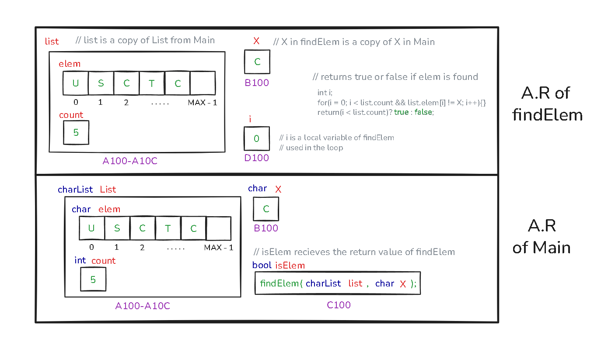
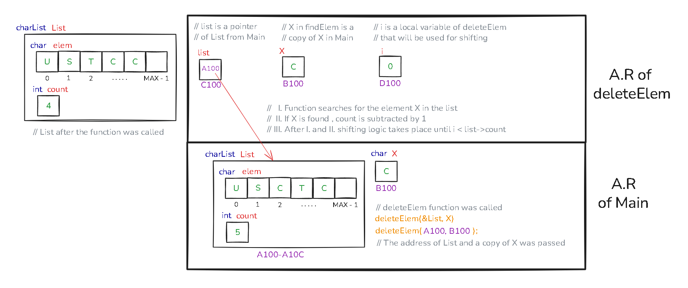
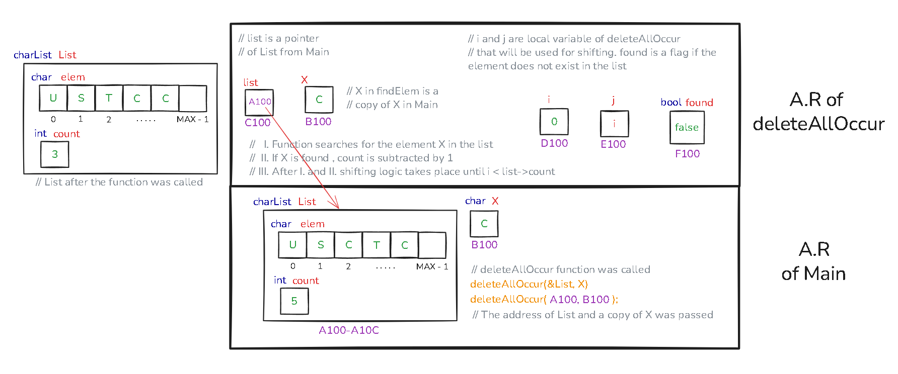

# Execution Stack Drawing

This document shows the execution stack representations for the functions `findElem`, `deleteElem`, and `deleteAllOccur`.  
Short descriptions are provided — diagrams should be placed below each description.

---

## 1. findElem

**Description:**  
When `findElem` is called, the stack frame is created with parameters `list` and `X`, plus the loop variable `i` and local flag if used. After execution, it returns a boolean result (`true`/`false`) to the caller.  

  

---

## 2. deleteElem

**Description:**  
For `deleteElem`, the stack frame includes the pointer to the list (`list`) and the target element `X`. Inside, shifting of elements may occur if a match is found. Local variables like loop indices (`i`, `j`) are placed in the frame. After the function finishes, control returns to `main` without a return value (`void`).  

  

---

## 3. deleteAllOccur

**Description:**  
The `deleteAllOccur` function builds its stack frame with the pointer to the list (`list`), the target element `X`, and loop counters (`i`, `j`). A local flag (`found`) may also exist. During execution, every occurrence of `X` is removed by shifting elements left. At the end, the function either prints a message or completes silently if deletions happened.  

  

---
