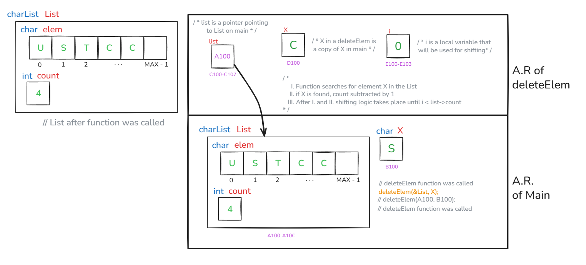
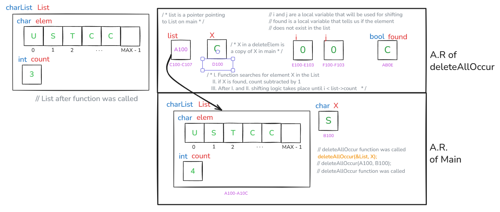

# Execution Stack Drawing

This document shows the execution stack representations for the functions `findElem`, `deleteElem`, and `deleteAllOccur`.  
Diagrams should be placed below each description.

---

## 1. findElem

**Description:**  
Execution stack contains the parameter `list`, the element `X`, and loop index `i`. The loop scans until either `X` is found or the end is reached. Returns `true` if found, otherwise `false`.

  

---

## 2. deleteElem

**Description:**  
Execution stack holds the pointer to `list`, the element `X`, and loop index `i`. If list is not empty and `X` is found, all elements after `X` are shifted left and `count` is reduced. If not found, prints a message.

  

---

## 3. deleteAllOccur

**Description:**  
Execution stack includes the pointer to `list`, the element `X`, a `found` flag, and loop counters `i` and `j`. Every occurrence of `X` is deleted by shifting elements left. If no occurrence is found, a message is printed.

  

---

